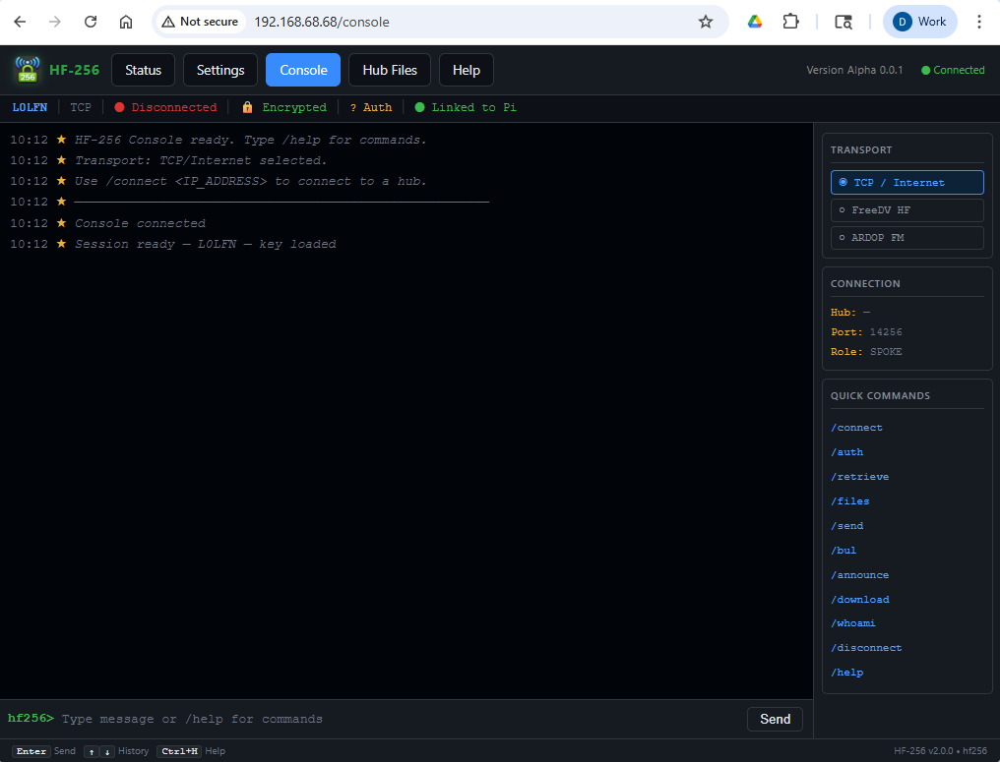
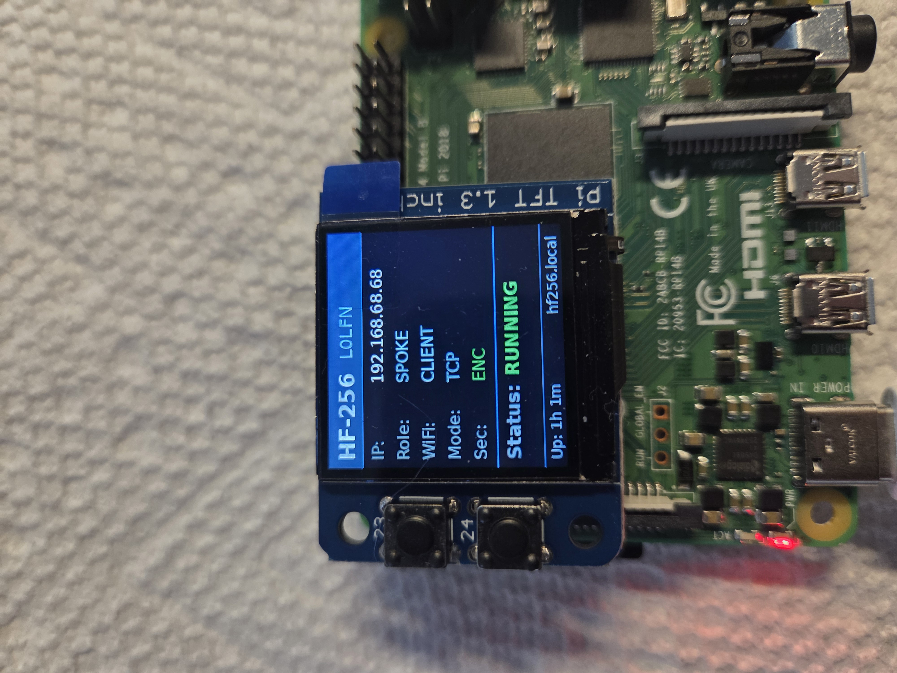

# HF-256

**Encrypted store-and-forward messaging over HF radio — in a Raspberry Pi appliance.**

HF-256 is a self-contained communication system that lets amateur radio operators exchange encrypted messages, files, and live chat across HF radio links. It runs entirely on a Raspberry Pi and is operated through a browser — no keyboard, no monitor, no command line required in normal use.

---



## What HF-256 Does

HF-256 creates a private, encrypted radio network between a **hub station** and one or more **spoke stations**. Every message, file, and chat is protected with AES-256-GCM encryption using a shared network key that only your group holds.

**You can:**
- Exchange live chat messages over HF radio
- Send store-and-forward messages to stations that are currently off the air
- Distribute files (emergency procedures, net schedules, maps) to field stations
- Run a hub station that holds messages and files until a field unit checks in
- Operate over TCP/IP (internet or LAN) for testing or when radio is not needed

**Supported transports:**
| Transport | Use case |
|-----------|----------|
| FreeDV HF | HF radio — fully open-source modem, no licence fees |
| ARDOP FM  | VHF/UHF FM radio — short range, fast |
| TCP | Internet or LAN — for testing and fixed infrastructure |

---

## Hardware

Each HF-256 node is a **Raspberry Pi 4** running the HF-256 software. Any station on your network can be reached with a phone, tablet, or laptop browser — the Pi serves the interface on port 80.

**Supported radio interfaces:**
- **DigiRig Mobile** — USB audio + RTS PTT, plug-and-play with most HF transceivers
- **Xiegu X6100** — direct USB audio + CAT PTT via CI-V

Other radios with a USB or serial PTT interface can be added through the setup wizard.

---

## The PiTFT Display



The HF-256 Pi appliance uses an **Adafruit Mini PiTFT 1.3" 240×240 colour display** mounted directly on the Pi's GPIO header. It provides at-a-glance status without needing a browser and is the primary way to operate the two physical controls on the unit.

### What the display shows

The display shows the current operating mode and network status — including the Pi's IP address, whether it is in hotspot mode or connected to a Wi-Fi network, and the station role (hub or spoke). This is updated dynamically as the network state changes.

When the IP address is shown you can type it directly into any browser on the same network to reach the HF-256 web interface.

### Physical buttons

The unit has two physical buttons. Their functions are:

**Reset to Hotspot mode (both buttons, 10 seconds)**
Hold **both buttons simultaneously for 10 seconds**. The display will confirm the reset. The Pi switches back to hotspot mode broadcasting the `HF256-N0CALL` network, allowing you to reconnect and reconfigure it. Use this if you have lost access to the web interface because the Pi joined a Wi-Fi network that is no longer available.

**Graceful shutdown (bottom button, 10 seconds)**
Hold the **bottom button for approximately 10 seconds** until the display shows **"Shutting down"**. Release the button. The Pi will complete a clean shutdown before cutting power. Always use this procedure rather than pulling the power — an unclean shutdown can corrupt the SD card.

### When to use the buttons

| Situation | Action |
|-----------|--------|
| Lost access to web interface — Wi-Fi changed | Hold both buttons 10s → reconnect to `HF256-N0CALL` |
| Powering down the unit | Hold bottom button 10s → wait for "Shutting down" |
| Normal operation | No button press needed — display shows current status |

---

## Network Roles

### Hub Station
The hub is the centre of the network. It runs continuously, listening for incoming connections from field stations. The hub:
- Holds messages for stations that are not currently on the air
- Stores files available for download by any authenticated station
- Authenticates connecting stations against a local user database
- Does not require the operator to be present — it listens automatically

### Spoke Station
A spoke is a field unit that calls into the hub. The spoke operator:
- Connects to the hub using `/connect <CALLSIGN>`
- Authenticates with `/auth <password>`
- Can chat live with the hub operator, send and retrieve messages, and download files
- Disconnects when done — the hub holds any messages for the next check-in

---

## First-Time Setup

When a HF-256 Pi is first powered on it has not yet been configured. It starts in **access point mode**, broadcasting its own Wi-Fi network so you can reach it from any phone, tablet, or laptop — no existing network or internet connection is required.

**Step 1 — Connect to the HF-256 Wi-Fi hotspot**

On your device, open Wi-Fi settings and connect to:

- **Network name:** `HF256-N0CALL`
- **Password:** `hf256setup`

Once connected your device will be on the Pi's local network. No internet access will be available while connected to this hotspot — that is normal.

**Step 2 — Open the setup page**

Open a browser and go to either:

- `http://hf256.local` — works on most phones, tablets, and modern computers
- `http://192.168.4.1` — use this if hf256.local does not resolve

The HF-256 setup wizard will load automatically.

**Step 3 — Select your radio and test hardware**

Select your radio interface (DigiRig Mobile or Xiegu X6100). The wizard will detect the serial port and audio device. Use the **Test PTT** and **Check Audio Level** buttons to confirm your radio is correctly connected before proceeding. This is the time to sort out any cable or interface issues — getting hardware confirmed here saves troubleshooting later.

**Step 4 — Callsign and role**
Enter your callsign and select whether this Pi will be a **Hub** or a **Spoke**.

**Step 5 — Network key**
All stations on your network must share the same AES-256 encryption key. Either generate a new key on the hub and distribute it, or paste in a key you have already received.

When setup completes the Pi switches from hotspot mode to its normal operating mode. If you configured it to join an existing Wi-Fi network it will do so now — reconnect your device to your normal network and browse to the Pi's new address shown on the final setup screen. If no Wi-Fi was configured the Pi remains in hotspot mode and is always reachable at `192.168.4.1`.

---

## The Console

The console is the main operating interface. Open it at `http://<pi-address>/console`.

```
┌─────────────────────────────────────────────────────┐
│ HF-256   Status   Settings   Console    Ver Alpha 0.0.1 │
├──────────────────┬──────────────────────────────────┤
│ L3LFN │ FreeDV   │ ⬤ Connected to L3RHUB            │
├──────────────────┴──────────────────────────────────┤
│                                                      │
│  ★ Session ready — L3LFN — key loaded               │
│  ★ Transport: FreeDV HF                             │
│  ★ ✓ Connected to L3RHUB                           │
│  ★ ✓ Authenticated — Welcome L3LFN                 │
│  → L3LFN: Hello from the field                     │
│  ★ ✓ Message delivered to hub                      │
│  ← L3RHUB: Copy that, standing by                  │
│                                                      │
├──────────────────────────────────────────────────────┤
│ > type message or /command                          │
└──────────────────────────────────────────────────────┘
```

The top of the console shows your callsign, transport mode, and connection state. Outgoing messages are shown with `→`, incoming with `←`, and system events with `★`.

---

## Typical Spoke Session

### 1. Select transport
The sidebar shows the available transports. Click **FreeDV HF** (or ARDOP, or TCP). The modem starts automatically.

### 2. Connect to the hub
```
/connect L3RHUB
```
The Pi transmits a connection request over the air. On a clear channel this typically completes in 10–30 seconds. The console will show `✓ Connected to L3RHUB` when the link is up.

### 3. Authenticate
```
/auth yourpassword
```
Your password is sent encrypted to the hub. On success: `✓ Authenticated — Welcome <CALLSIGN>`.

### 3a. Change your password (optional)
```
/passwd yourpassword newpassword
```
Changes your password on the hub. You must be authenticated first. The change takes effect immediately — use the new password next time you `/auth`.

### 4. Retrieve waiting messages
```
/retrieve
```
The hub delivers any messages stored for you since your last check-in.

### 5. Send live chat
Just type and press Enter. Your message appears immediately and a `✓ Message delivered to hub` confirmation appears when the hub's radio has acknowledged receipt.

### 6. Send a message to an offline station
```
/send W1ABC Check in at 0900Z tomorrow on 14.300
```
The hub stores the message. When W1ABC next checks in and runs `/retrieve`, they will receive it.

### 7. List and download files
```
/files
/download emergency_plan.pdf
```
The hub sends the file in chunks over the ARQ link. A progress indicator shows each chunk as it arrives. Use `/cancel` to abort a download in progress.

### 8. Disconnect
```
/disconnect
```
A clean disconnect packet is sent to the hub. If the link drops without a clean disconnect, both sides will time out automatically after 2 minutes of silence.

---

## Hub Operations

The hub console works the same way as a spoke console, with additional commands available because no outgoing connection is needed.

### Adding users
```
/adduser W1ABC secretpassword
/adduser W2DEF anotherpassword
```
User credentials are stored locally on the hub Pi.

### Changing a password
```
/passwd currentpassword newpassword
```
The hub operator can change their own password without needing a radio connection. Spoke stations can also use `/passwd` while connected to change their own hub password remotely. Both hub and spoke must be authenticated before using `/passwd`.

### Listing users
```
/listusers
```

### Checking stored messages and files
```
/storage
```
Shows how many messages are queued for each recipient and how many files are available for download.

### Live chat with a connected station
When a spoke is connected the hub operator can simply type to reply. No authentication or `/connect` is needed on the hub — the hub is always ready.

### Adding files for distribution
Open `http://<hub-pi-address>/files` in your browser. The **Hub Files** page lets you:

- **Upload** any file by clicking the upload area or dragging and dropping — add an optional description that will be shown to spoke stations in the `/files` listing
- **Edit** the description of any file already on the hub by clicking the ✎ button
- **Delete** any file with the 🗑 button

The Hub Files page is available in the navigation bar on all pages. It is accessible from any device on the same network as the hub Pi — no command line access is needed.

Files are sent in 512-byte chunks over the ARQ link. On FreeDV DATAC1 at typical HF speeds a 50 KB file takes approximately 10–15 minutes. Plan accordingly.

---

## FreeDV Modes

The FreeDV mode is selected from the sidebar in the console. All stations in a QSO must use the same mode.

| Mode | Bandwidth | Speed | Use when |
|------|-----------|-------|----------|
| DATAC1 | 1.25 kHz | ~980 bps | Standard — good balance of speed and robustness |
| DATAC3 | 0.5 kHz | ~450 bps | Crowded bands, narrow filters, marginal conditions |
| DATAC4 | 2.5 kHz | ~2200 bps | Excellent conditions, fast file transfers |

**DATAC1 is recommended as the starting point.** If you are having trouble completing connections, try DATAC3. If conditions are excellent and you need faster file transfers, try DATAC4.

---

## TCP Mode — Private Encrypted Internet Communications

TCP mode connects two HF-256 stations directly over the internet or a local area network without any radio hardware. Despite the name, TCP mode is not limited to local use — it works across the public internet anywhere two stations can reach each other over port 14256.

**Why use TCP mode:**

When used with encryption enabled, TCP mode gives you a **private, authenticated messaging platform** that works anywhere in the world with an internet connection. All traffic — chat, stored messages, and file transfers — is protected with the same AES-256-GCM encryption used over the air. An eavesdropper on the network sees only encrypted ciphertext. The hub authenticates every connecting station against its user database before any traffic is exchanged.

This makes TCP mode useful well beyond testing:
- A fixed hub at an EOC or club station can be reached by members anywhere in the world
- Operators travelling internationally can stay in contact with their home network
- During internet-available emergencies, TCP provides instant full-speed connectivity that falls back to radio when the internet fails

**Connecting over TCP:**
```
/connect 203.0.113.45
```
or if the hub operator has a DNS name:
```
/connect hub.example.net
```

The hub must have port 14256 open and reachable. For a hub behind a home router, standard port forwarding applies. Speed over TCP is limited only by the internet connection — file transfers that take 15 minutes over HF complete in seconds.

---

## ARDOP FM — Local VHF/UHF and FM Band Communications

ARDOP FM uses the same ARDOP protocol but is optimised for **FM rather than SSB**, making it suitable for VHF, UHF, and any FM-capable band. This opens HF-256 to a much wider range of local and regional communication scenarios that do not require HF propagation.

**Use cases for ARDOP FM:**

- **Local emergency nets** — a club or ARES group running ARDOP FM on a 2m or 70cm FM simplex or repeater frequency gets the full HF-256 feature set (encryption, store-and-forward, file distribution) at VHF speeds and ranges
- **Linked repeater systems** — where a repeater network connects a wide area, ARDOP FM can carry HF-256 traffic across that network giving store-and-forward capability without internet
- **Field day and portable operations** — a handheld or mobile radio with a DigiRig interface is all that is needed; no HF antenna or licence upgrade required for operators holding a Technician class licence
- **Backup path** — a site that normally uses internet TCP can fall back to ARDOP FM on VHF when both internet and HF are unavailable

**Speed:** ARDOP FM operates considerably faster than HF modes. On a clear VHF FM path, data rates of several kilobits per second are achievable, making file transfers that would take many minutes on HF complete in seconds.

**Selecting ARDOP FM:** Click **ARDOP FM** in the console sidebar. The same DigiRig Mobile or compatible USB audio interface used for HF works on VHF — simply connect it to your VHF/UHF radio instead.

---

## Command Reference

### Connection
| Command | Description |
|---------|-------------|
| `/connect <CALLSIGN>` | Connect to a hub station (FreeDV/ARDOP) or `/connect <IP>` (TCP) |
| `/disconnect` | Cleanly disconnect from the hub |

### Authentication
| Command | Description |
|---------|-------------|
| `/auth <password>` | Authenticate with the hub |
| `/passwd <current> <new>` | Change your password (hub: local, spoke: transmits to hub) |
| `/encrypt on\|off` | Toggle AES-256-GCM encryption |
| `/whoami` | Show callsign, transport, connection and auth status |

### Messaging
| Command | Description |
|---------|-------------|
| (type + Enter) | Send live chat to connected hub |
| `/send <CALL> <message>` | Store a message for an offline station |
| `/retrieve` | Retrieve messages stored for you at the hub |

### File transfer
| Command | Description |
|---------|-------------|
| `/files` | List files available on the hub |
| `/download <filename>` | Download a file from the hub |
| `/cancel` | Cancel a download in progress |

### FreeDV
| Command | Description |
|---------|-------------|
| `/announce <message>` | Broadcast to all listening stations (no connection needed) |

### Hub only
| Command | Description |
|---------|-------------|
| `/adduser <CALL> <password>` | Add a user to the hub |
| `/listusers` | List all registered users |
| `/storage` | Show queued messages and available files |

### General
| Command | Description |
|---------|-------------|
| `/clear` | Clear the console window |
| `/help` | Show the command reference panel |

---

## Encryption

All traffic is encrypted with **AES-256-GCM** using a 256-bit network key shared among all stations. The key never travels over the air. Every message, file chunk, and authentication packet is individually encrypted with a random 96-bit IV — no two transmissions look the same even if the content is identical.

The network key is stored in `/etc/hf256/network.key` on each Pi. Protect it as you would any cryptographic credential. If the key is compromised, generate a new one on the hub and distribute it to all stations out-of-band.

Store-and-forward messages are **double encrypted**: first with the network key when sent over the air, and stored on the hub encrypted again so that hub storage compromise does not expose message content.

## Global Use and Regulatory Compliance

HF-256 is designed to be useful to amateur radio operators worldwide. Radio regulations differ significantly between countries — in particular, the rules governing encryption over amateur radio vary.

**In some countries**, including the United States (47 CFR Part 97), Canada, and many others, encryption of amateur radio transmissions is either prohibited or restricted to specific circumstances. **HF-256 fully supports plaintext operation** to comply with these rules.

To disable encryption:
```
/encrypt off
```

The status bar will show **PLAINTEXT** as a reminder whenever encryption is off. All message content, file transfers, and chat will be transmitted in the clear. Re-enable at any time with `/encrypt on`.

**In other countries** where encryption is permitted or where HF-256 is being used on licensed private frequencies or in emergency management contexts, the full AES-256-GCM encryption capability can be used.

**It is the responsibility of each operator to understand and comply with the laws and licence conditions that apply in their jurisdiction.** If you are unsure, operate in plaintext mode and consult your national amateur radio society.

The network key is only used when encryption is enabled. Plaintext mode stations and encrypted stations cannot communicate directly — all stations in a session must use the same mode. The hub operator can enforce this by ensuring all registered users configure their stations consistently.

---

## Troubleshooting

**Connection attempts time out / no CONN_ACK received**
- Confirm the hub Pi has FreeDV selected and the modem is running (green status on the hub's Status page)
- Check that both stations are on the same frequency and mode
- Try DATAC3 — it is more robust on marginal paths
- The spoke will retry automatically up to 5 times before giving up

**Authentication times out after connecting**
- Check that your callsign is registered on the hub (`/listusers` on the hub console)
- Verify the password is correct
- Confirm both stations have the same network key loaded (Status page shows key status)

**File download stalls mid-transfer**
- This is usually RF — the ARQ will retry automatically up to 3 times per chunk
- If the link drops, use `/disconnect` and reconnect to restart the session
- Use `/cancel` to abort cleanly then try again

**Hub shows "KISS socket closed" and restarts the listener**
- This is normal after a disconnect — the listener restarts automatically
- If it happens repeatedly without any connection attempt, check that `freedvtnc2` is running on the Status page

**Both sides disconnected but the console still shows Connected**
- The inactivity watchdog will disconnect after 2 minutes of silence
- You can force disconnect with `/disconnect` at any time

**No audio / PTT not keying**
- Visit the Status page and run the PTT test
- Check the audio card number in Settings matches the device shown by `arecord -l`
- For DigiRig: confirm the USB serial port is `/dev/ttyUSB0`
- For Xiegu X6100: confirm the CI-V baud rate is 19200

---

## File Locations on the Pi

```
/etc/hf256/
├── network.key          ← AES-256 network key (protect this)
├── settings.json        ← Station configuration
└── config.env           ← Modem startup parameters

/home/pi/.hf256/
├── passwords.json       ← Hub user database (hub only)
├── hub_files/           ← Files available for download (hub only)
│   ├── document.pdf
│   └── document.pdf.desc
└── hub_messages/        ← Stored messages per recipient (hub only)
    └── W1ABC/
        └── 1700000000000

/opt/hf256/
├── portal/              ← Web portal (Flask)
└── hf256/               ← Core Python package
```


---

## SSH Access

Each Pi is accessible via SSH for diagnostics and administration.

```
Username: pi
Password: 12345678
```

Connect from any device on the same network:

```bash
ssh pi@hf256.local
# or by IP address
ssh pi@192.168.4.1      # when Pi is in AP mode
ssh pi@<assigned-ip>    # when Pi is in client WiFi mode
```

The IP address is shown on the PiTFT display. If you cannot connect via `hf256.local`, use the IP address directly.

> **Security note:** Change the default password after initial setup using `passwd` at the SSH prompt. This is especially important for hub stations accessible from a wider network.

---

*HF-256 — Version Alpha 0.0.1*
